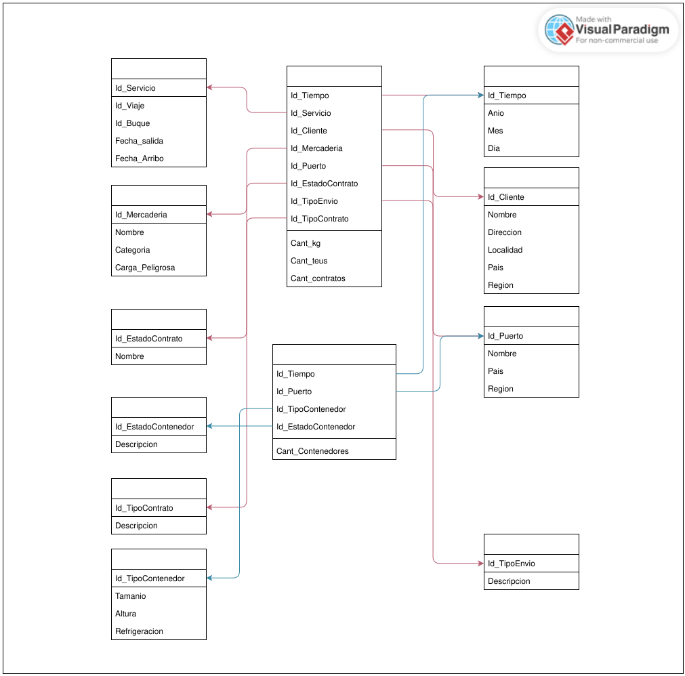
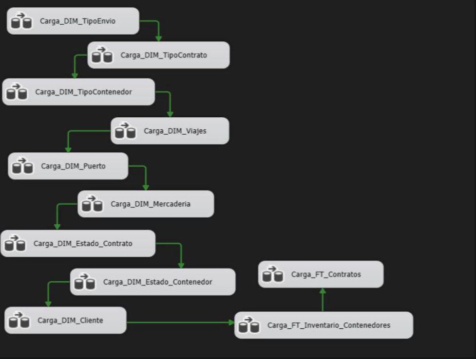
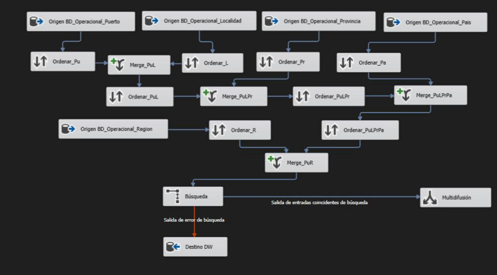
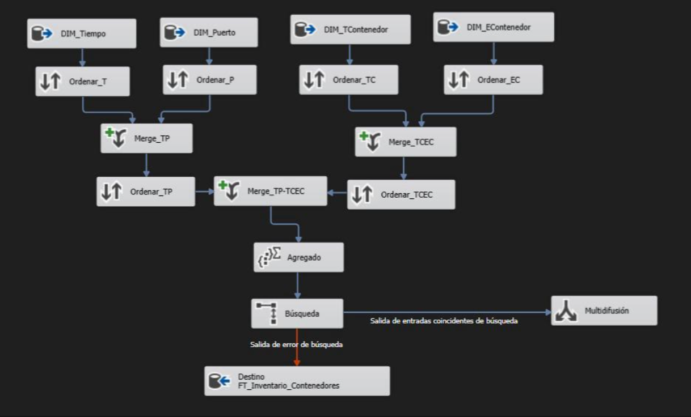
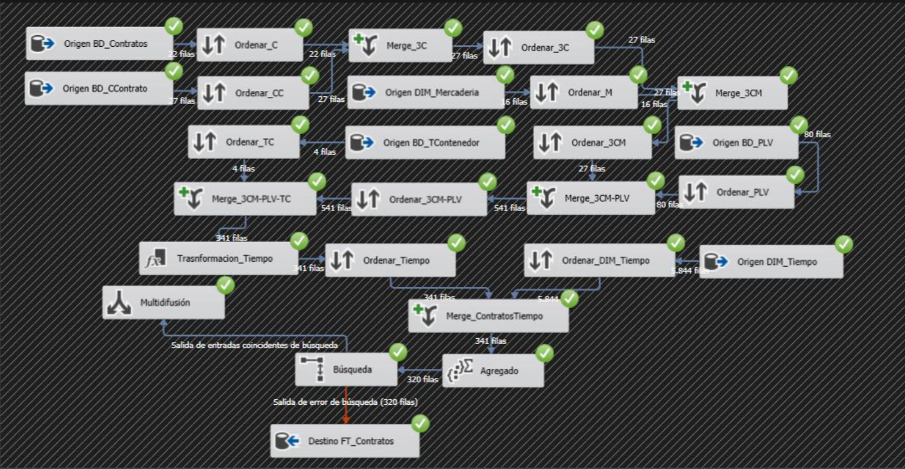
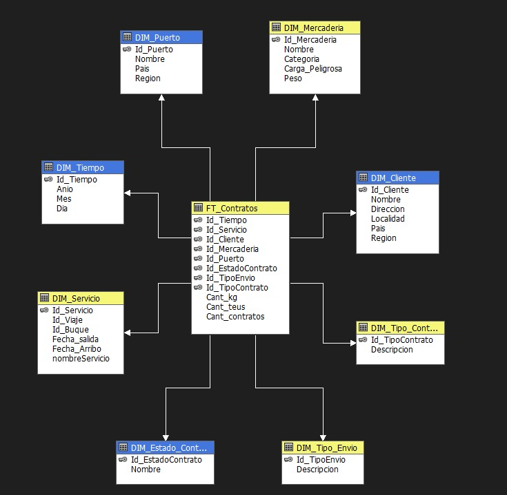
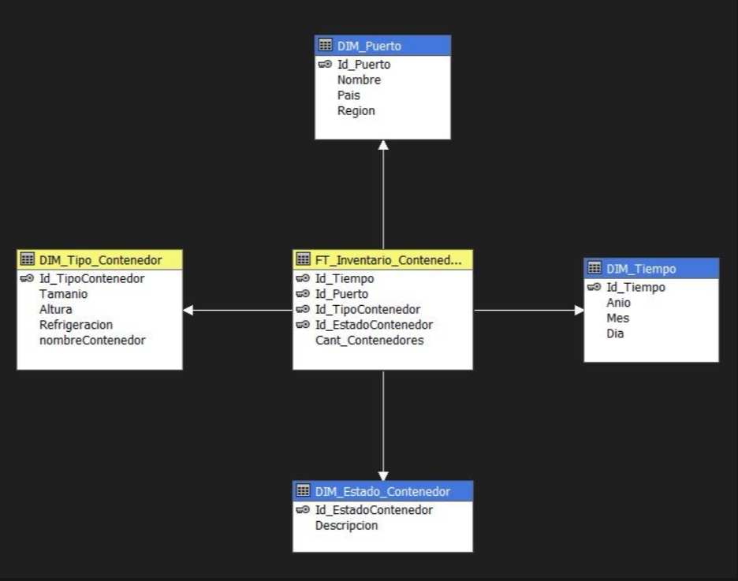
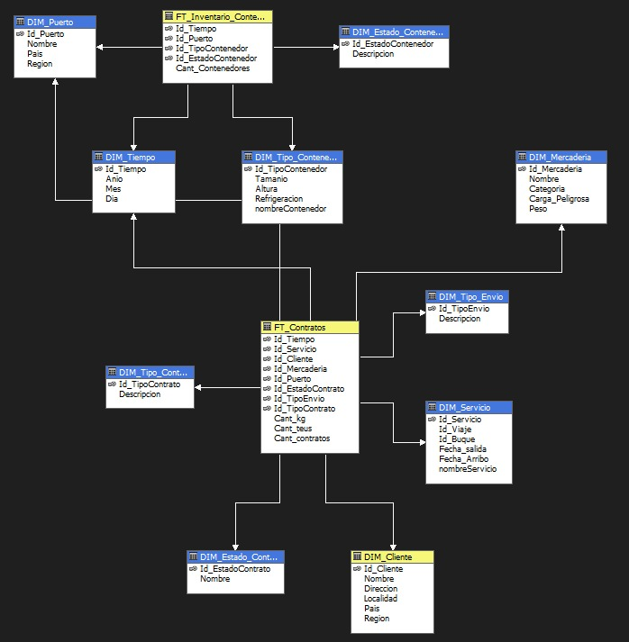

# Data Warehouse y cubos OLAP para logística internacional

Data Warehouse en **esquema de constelación** sobre SQL Server para una naviera de transporte
de contenedores: dos tablas de hechos —contratos e inventario de contenedores— alimentadas por
un **ETL de once flujos en SSIS** desde la base transaccional, y explotadas por **tres cubos
OLAP en Analysis Services** y una notebook **PySpark** sobre Google Colab.

Trabajo Práctico Final de **Base de Datos III** — Ingeniería en Informática, Universidad
Católica de Santiago del Estero, Departamento Académico Rafaela. Junio de 2025.



> Dos tablas de hechos que comparten `DIM_Tiempo` y `DIM_Puerto`: eso es lo que convierte al
> modelo en una constelación y no en dos estrellas independientes, y lo que hace posible el
> tercer cubo, que cruza contratos con inventario sobre las dimensiones conformadas.

---

## Índice

- [El caso de estudio](#el-caso-de-estudio)
- [Stack](#stack)
- [El modelo dimensional](#el-modelo-dimensional)
- [El ETL en SSIS](#el-etl-en-ssis)
- [Los cubos OLAP](#los-cubos-olap)
- [La notebook PySpark](#la-notebook-pyspark)
- [Cómo levantarlo](#cómo-levantarlo)
- [Sobre las credenciales](#sobre-las-credenciales)
- [Qué haría distinto hoy](#qué-haría-distinto-hoy)
- [Sobre el contexto de la entrega](#sobre-el-contexto-de-la-entrega)
- [Contenido del repositorio](#contenido-del-repositorio)
- [Créditos](#créditos)

---

## El caso de estudio

**Logística Internacional S.A.** transporta carga en contenedores entre puertos locales y del
exterior. La cátedra entregó la base operativa ya modelada —21 tablas, documentadas en
[`docs/modelo-datos-operacional-catedra.xlsx`](docs/modelo-datos-operacional-catedra.xlsx)— y
pidió construir sobre ella un único Data Warehouse capaz de responder tres requerimientos de
dirección:

| # | Requerimiento | Dónde se resuelve |
|---|---|---|
| 1 | Analizar contratos (cantidad, TEUs, kg) por tipo de contrato, tipo de envío, servicio, región, categoría de mercadería y puerto | `FT_Contratos` + [`G5_CuboE1`](olap/TP_OLAP_G5/G5_CuboE1.cube) |
| 2 | Disponibilidad de contenedores por puerto, día y tipo | `FT_Inventario_Contenedores` + [`G5_CuboE2`](olap/TP_OLAP_G5/G5_CuboE2.cube) |
| 3 | Granularidad mínima: diaria para inventario, mensual para cantidades contratadas | `DIM_Tiempo` a nivel día para ambos hechos |

El negocio tiene tres procesos y todos terminan reflejados en el DW: **contratos** (importación
o exportación, con remitente, destinatario, puertos de carga y descarga y cinco estados
posibles), **contenedores** (de 20 o 40 pies —1 o 2 TEUs—, refrigerados o no, con ocho tipos de
movimiento registrados) y **servicios** (buques que hacen viajes con escalas en puertos, con
fechas estimadas y reales de arribo y partida).

El enunciado completo está en
[`docs/enunciado-tp-logistica-2025.pdf`](docs/enunciado-tp-logistica-2025.pdf) y el informe
entregado en [`docs/informe-tp1-tp2-bdd3.pdf`](docs/informe-tp1-tp2-bdd3.pdf).

## Stack

| Componente | Versión / detalle |
|---|---|
| Motor relacional | SQL Server 2022 (MSSQL16), instancia remota compartida por el grupo |
| ETL | SQL Server Integration Services — package format 8, SSDT 16.0.5685 |
| OLAP | SQL Server Analysis Services **multidimensional** (MOLAP) |
| IDE | Visual Studio 2022 (17.14) con las extensiones SSIS y SSAS |
| Análisis | Google Colab · PySpark · driver `mssql-jdbc` 11.2.0.jre8 |
| Diagramación | draw.io (el SVG de arriba es el original de la entrega) |

## El modelo dimensional

**Dos hechos y diez dimensiones.** El grano de cada tabla de hechos está fijado por su clave
primaria, que es la concatenación de todas sus claves foráneas: no hay clave subrogada, y eso
mismo impide cargar dos veces la misma combinación.

| `FT_Contratos` | |
|---|---|
| Grano | día × servicio × cliente × mercadería × puerto de carga × estado × tipo de envío × tipo de contrato |
| Medidas | `Cant_kg` (peso declarado en `Contenedor_Contrato`), `Cant_teus` (equivalente TEU del tipo de contenedor), `Cant_contratos` (conteo) |

| `FT_Inventario_Contenedores` | |
|---|---|
| Grano | día × puerto × tipo de contenedor × estado de contenedor |
| Medidas | `Cant_Contenedores` (conteo de movimientos del día) |

Las dimensiones conformadas son `DIM_Tiempo` y `DIM_Puerto`: las dos tablas de hechos las
comparten, y por eso pueden analizarse juntas. Las ocho restantes cuelgan de un solo hecho:
`DIM_Cliente`, `DIM_Servicio`, `DIM_Mercaderia`, `DIM_Estado_Contrato`, `DIM_Tipo_Contrato` y
`DIM_Tipo_Envio` de contratos; `DIM_Tipo_Contenedor` y `DIM_Estado_Contenedor` de inventario.

La clave de `DIM_Tiempo` no es un autoincremental sino la **fecha codificada como entero** —
`20250601` para el 1 de junio de 2025—, construida en el propio pipeline (ver más abajo). Es
legible a simple vista en cualquier consulta y ordena cronológicamente sin joins.

El DDL entregado está en [`sql/03_esquema_dw.sql`](sql/03_esquema_dw.sql). La jerarquía
geográfica de la base operativa —`Regiones → Países → Provincias → Localidades`, cuatro tablas
normalizadas— se aplana durante el ETL a tres columnas dentro de `DIM_Puerto` y cinco dentro de
`DIM_Cliente`. Ese aplanamiento es todo el trabajo de los flujos más grandes del paquete.

## El ETL en SSIS

Un único paquete, [`etl/TP_G5/Package.dtsx`](etl/TP_G5/Package.dtsx), con **once tareas de flujo
de datos encadenadas en serie** por restricciones de precedencia. Las nueve dimensiones primero,
los dos hechos al final:

```
TipoEnvio → TipoContrato → TipoContenedor → Viajes → Puerto → Mercadería
   → EstadoContrato → EstadoContenedor → Cliente
      → FT_Inventario_Contenedores → FT_Contratos
```



> Las once tareas tal como quedaron encadenadas en el diseñador de SSIS. La cadena es
> estrictamente secuencial —cada tarea espera a que termine la anterior— aunque nueve de las
> once dimensiones no dependen entre sí y podrían cargarse en paralelo.

En total, 31 orígenes OLE DB, 40 componentes de ordenamiento, 20 merge joins, 11 búsquedas y
2 agregaciones. Los flujos de dimensión que consumen una sola tabla operativa tienen cuatro
componentes; `Carga_DIM_Puerto` tiene veinte, porque reconstruye la cadena geográfica completa
uniendo `Puertos`, `Localidades`, `Provincias`, `Paises` y `Regiones`.



> Cuatro niveles de merge join —`Puerto+Localidad`, `+Provincia`, `+País`, `+Región`— cada uno
> precedido por su propio `Sort`, para aplanar una jerarquía de cuatro tablas normalizadas en
> las tres columnas planas de `DIM_Puerto`.

### El patrón que hace el paquete re-ejecutable

Es la decisión de diseño más interesante del ETL, y no es evidente al mirar el diagrama. Cada
flujo termina igual:

1. Una transformación **Búsqueda** consulta la tabla destino del DW usando **todas las columnas
   de la fila como clave**, no sólo el ID:

   ```sql
   select * from (select * from [dbo].[DIM_Estado_Contrato]) [refTable]
   where [refTable].[Id_EstadoContrato] = ? and [refTable].[Nombre] = ?
   ```

2. La **salida de coincidencias** —las filas que ya están en el DW— va a una Multidifusión sin
   destino: se descartan.
3. La **salida de error** —las filas sin coincidencia— es la que va al destino OLE DB.

El efecto es una anti-unión contra el destino: correr el paquete dos veces no duplica ninguna
fila. Es idempotencia real, construida antes de que apareciera el problema. La objeción está en
la implementación, no en la idea: usa la salida de *error* de la búsqueda para transportar
filas válidas, cuando SSIS ofrece para eso la salida "sin coincidencia" (`NoMatchBehavior = 2`).
Funciona, pero cualquier error genuino de la búsqueda —una conversión de tipo, una conexión
caída— también termina insertado en el DW.



> El patrón completo en su versión más legible: cuatro orígenes se combinan en dos ramas
> (`Merge_TP`, `Merge_TCEC`), se unen y agregan, y la `Búsqueda` final separa lo que ya existe
> en el DW —descartado en `Multidifusión`— de lo nuevo, que sigue hacia `Destino`.

### La clave de tiempo

`DIM_Tiempo` se referencia con un entero `AAAAMMDD` que se calcula en una columna derivada
dentro del pipeline, sin tocar la base operativa:

```
(DT_I4)(YEAR(fecha_movimiento) * 10000 + MONTH(fecha_movimiento) * 100 + DAY(fecha_movimiento))
```

Después, un merge join contra `DIM_Tiempo` valida que la fecha exista en la dimensión antes de
escribir el hecho.

### Las medidas

Ambos hechos terminan en una transformación de **Agregación**. `Cant_contratos` y
`Cant_Contenedores` son conteos sobre el grupo; `Cant_kg` y `Cant_teus` se arrastran desde
`Contenedor_Contrato` y `Tipos_Contenedor` a través de la cadena de merge joins que arma el
flujo antes de agrupar.



> El flujo más grande del paquete: seis orígenes convergiendo en cuatro niveles de merge join
> antes de llegar a `DIM_Tiempo`, agregar y buscar contra el destino. Cada rama que se une
> exige que ambas entradas lleguen ordenadas por la clave del join —de ahí los nueve `Sort`
> visibles en esta sola captura, de los 40 que tiene el paquete completo.

## Los cubos OLAP

Tres cubos multidimensionales sobre el mismo Data Source View
([`Modelo_DW.dsv`](olap/TP_OLAP_G5/Modelo_DW.dsv)), uno por requerimiento y uno que los cruza:

| Cubo | Grupos de medida | Dimensiones | Responde |
|---|---|---|---|
| [`G5_CuboE1`](olap/TP_OLAP_G5/G5_CuboE1.cube) | `FT Contratos` | 8 | Requerimiento 1: contratos, TEUs y kg por contrato, envío, servicio, mercadería, puerto, cliente, estado y tiempo |
| [`G5_CuboE2`](olap/TP_OLAP_G5/G5_CuboE2.cube) | `FT Inventario Contenedores` | 4 | Requerimiento 2: disponibilidad por puerto, tipo y estado de contenedor, por día |
| [`G5_CuboE3`](olap/TP_OLAP_G5/G5_CuboE3.cube) | **ambos** | 10 | Análisis cruzado: contratos e inventario sobre las dimensiones conformadas |



> `G5_CuboE1` visto desde el Data Source View: la estrella de `FT_Contratos` con sus ocho
> dimensiones, tal como la muestra Visual Studio.



> `G5_CuboE2`: la estrella más chica de las tres, cuatro dimensiones alrededor de
> `FT_Inventario_Contenedores`. Es la que responde el requerimiento 2 sin nada de más.

El tercero es el que justifica la constelación. Un cubo con dos grupos de medida sólo tiene
sentido si comparten dimensiones —`DIM_Tiempo` y `DIM_Puerto`—; sobre las demás, Analysis
Services devuelve nulos en el grupo que no las tiene, que es exactamente el comportamiento
esperado de una matriz de bus.



> `G5_CuboE3`: los dos hechos sobre las diez dimensiones. Se ve el punto de unión —`DIM_Tiempo`
> y `DIM_Puerto` reciben flechas de ambas tablas de hechos— y también las columnas que la base
> real tiene y el `creacionDW.sql` de la entrega nunca incorporó: `Peso`, `nombreServicio`,
> `nombreContenedor`.

Tres dimensiones llevan jerarquía de usuario definida a mano: `Ubicacion` en `DIM_Puerto`
(país y región), `Ubicacion` en `DIM_Cliente` (dirección, localidad, país y región) y `Tiempo`
en `DIM_Tiempo` (día, mes y año). Sobre el orden de esos niveles, ver
[Qué haría distinto hoy](#qué-haría-distinto-hoy).

## La notebook PySpark

La segunda mitad del práctico pedía consultar el DW desde Google Colab con PySpark, conectado
por JDBC. Está en [`notebook/TP2_Grupo5.ipynb`](notebook/TP2_Grupo5.ipynb), **con las salidas de
la corrida original conservadas**.

| Consulta | Enunciado | Resultado obtenido |
|---|---|---|
| 1 | Puerto que más participó en contratos (últimos 10 años) | Puerto de Buenos Aires, 84 contratos |
| 2 | Tipos de contenedor con más de 500 transportes en la semana | vacío — el volumen cargado no llega al umbral |
| 3 | Tipos de envío contratados en (casi) todos los meses | `Door` |
| 4 | Estación más fructífera por TEUs | Invierno 224, Verano 180, Otoño 59, Primavera 59 |

Las consultas 2 y 3 devuelven poco o nada, y el informe lo dice sin maquillarlo: los umbrales
del enunciado —500 transportes semanales, doce meses del año— exceden el volumen de datos que
el grupo llegó a generar. La entrega incluye variantes `2b` y `3b` con umbrales bajados a 2
transportes y 6 meses para poder mostrar resultados. Preferir eso antes que inflar los datos
para que la consulta "dé bien" es la decisión correcta.

## Cómo levantarlo

Hace falta **SQL Server 2022** (los backups son MSSQL16, no restauran en versiones anteriores) y
**Visual Studio 2022** con las extensiones *SQL Server Integration Services Projects* y
*Analysis Services Projects*.

### 1. Restaurar el Data Warehouse

```sql
RESTORE FILELISTONLY FROM DISK = 'C:\ruta\al\repo\data\DW-TPFinal_G5.bak';

RESTORE DATABASE DW FROM DISK = 'C:\ruta\al\repo\data\DW-TPFinal_G5.bak'
WITH MOVE 'DW'     TO 'C:\...\MSSQL\DATA\DW.mdf',
     MOVE 'DW_log' TO 'C:\...\MSSQL\DATA\DW_log.ldf',
     RECOVERY;
```

Ese backup trae el DW cargado, que es el único lugar donde sobrevive el dataset real: unos 200
puertos de todo el mundo con sus países y regiones, y contratos fechados desde 2023. Los
scripts de [`sql/02_datos_operacionales.sql`](sql/02_datos_operacionales.sql) sólo cubren una
parte —junio de 2025, sin la carga geográfica ni los clientes— y por sí solos no reproducen la
base que consumió el ETL.

### 2. La base operativa

[`data/BD-TPFinal_G5.bak`](data/) es, literalmente, un backup de la base **`master`** del
servidor: las 21 tablas del sistema transaccional se crearon dentro de la base de sistema, y
así quedaron. Restaurar `master` no es una operación ordinaria —exige levantar la instancia en
modo usuario único y reemplaza la configuración del servidor—, de modo que el backup vale como
evidencia de lo entregado más que como paso reproducible. Para volver a correr el ETL, lo
razonable hoy es crear una base nueva y proyectar ahí las tablas con
[`sql/01_esquema_operacional.sql`](sql/01_esquema_operacional.sql).

### 3. Abrir los proyectos

```
etl/TP_G5/TP_G5.sln            → paquete SSIS
olap/TP_OLAP_G5/TP_OLAP_G5.sln → proyecto SSAS (Deploy + Process, después Browser)
```

Ambos apuntan al placeholder `SQLSERVER_CATEDRA`: hay que reemplazarlo por la instancia propia
en los administradores de conexión (`DW.conmgr`, `BDmaster.conmgr`) y en los orígenes de datos
del proyecto OLAP (`DW.ds`, `Master.ds`).

### 4. La notebook

Corre en Google Colab tal como está. Espera tres variables de entorno —`DW_SERVER`, `DW_USER` y
`DW_PASSWORD`— en lugar de las credenciales que tenía escritas en el código.

## Sobre las credenciales

El paquete SSIS, los orígenes de datos OLAP y la notebook apuntaban por IP a la instancia
compartida del grupo, con el usuario `sa` y la contraseña en texto plano dentro de una celda de
Colab. En las copias de este repositorio la IP fue reemplazada por `SQLSERVER_CATEDRA`, los
blobs de contraseña cifrados por DPAPI que SSIS deja incrustados en el XML fueron vaciados, y la
notebook lee las credenciales del entorno. El informe entregado incluía además una captura de la
celda de conexión con las tres credenciales visibles: ese bloque está tapado en la copia de
`docs/`.

Es el único cambio hecho sobre los archivos entregados. Todo lo demás —flujos, expresiones,
cubos, jerarquías y las salidas de la notebook— está tal como se entregó el 15 de junio de 2025.

## Qué haría distinto hoy

Releer el trabajo con distancia deja ver defectos que en su momento no se vieron. Los que siguen
son verificables abriendo los archivos del repositorio.

**1. Las tres jerarquías OLAP están definidas al revés.** En Analysis Services los niveles de una
jerarquía se declaran de lo general a lo particular. Las tres del proyecto los declaran al
revés: `Tiempo` es `Día → Mes → Año` y `Ubicacion` es `País → Región` en puertos y
`Dirección → Localidad → País → Región` en clientes. El cubo procesa igual, pero el drill-down
queda invertido: se empieza por el día y se "baja" al año, cuando el sentido natural del
análisis es el contrario. Se corrige invirtiendo el orden de los `<Level>` en cada `.dim`.

**2. Las dimensiones no tienen relaciones de atributo.** Ninguna de las diez declara
`AttributeRelationship`: todos los atributos cuelgan directamente de la clave. Definir que mes
determina año, y localidad determina país y región, es lo que le permite a SSAS agregar
resultados parciales en vez de recorrer el nivel hoja en cada consulta.

**3. Los cubos exponen como medidas cosas que no lo son.** Al construir grupos de medida sobre
tablas de dimensión, Analysis Services generó medidas automáticas: `Id Viaje`, `Id Buque`,
`Peso`, `Tamanio`, `Localidad`, `Pais`, `Region`. Sumar identificadores de buque no significa
nada, y quedan visibles para el usuario final. Había que borrarlas.

**4. El cubo 3 duplica las dimensiones en lugar de reusarlas.** Tiene `DIM Cliente 1`,
`DIM Tiempo 1`, `DIM Servicio 1` y siete más: diez definiciones repetidas en disco, cada una con
su propio procesamiento y su propia caché. El punto de una matriz de bus es exactamente lo
contrario —una dimensión conformada, referenciada desde varios cubos.

**5. El DW pierde el lado de destino de cada contrato.** `FT_Contratos` referencia sólo
`puerto_de_carga_id` y `cliente_remitente_id`. El enunciado pedía analizar por "región de
destino/origen" y "puerto de carga/descarga/origen/destino", y el documento de la primera
entrega proponía `DIM_Puerto_Origen` y `DIM_Puerto_Destino`; la implementación las colapsó en
una sola referencia. Se resuelve con dos claves foráneas a la misma `DIM_Puerto` (dimensiones
con rol), sin duplicar la tabla.

**6. Cuarenta ordenamientos en memoria.** Cada merge join del paquete exige entradas ordenadas,
y el paquete lo resuelve con un componente `Sort` por rama: 40 en total. Un `Sort` es bloqueante
—retiene el flujo entero antes de emitir la primera fila. Alcanzaba con poner `ORDER BY` en el
`SELECT` de origen y marcar la salida como ordenada (`IsSorted`), o directamente resolver los
joins en el SQL del origen, que es lo que SQL Server hace mejor. Los orígenes hoy son tablas
enteras (`[dbo].[Clientes]`, `[dbo].[Puertos]`, …) sin una sola cláusula `WHERE`.

**7. No hay carga incremental ni historial.** El patrón de búsqueda evita duplicados, pero un
cambio en una fila existente —un cliente que se muda— nunca llega bien al DW: la fila vieja
queda intacta y la nueva entra como registro adicional. Un tratamiento de dimensiones lentamente
cambiantes (SCD tipo 2, con vigencia desde/hasta) es lo que faltaba. Los hechos, además, se
recalculan desde el origen completo en cada corrida.

**8. `DIM_Tiempo` no tiene proceso de carga.** No hay flujo que la alimente: se cargó a mano. Una
dimensión de calendario se genera con un script recursivo, y de paso se le agregan trimestre,
semana, día de la semana y bandera de fin de semana —que es lo que habría permitido responder la
consulta 2 de la notebook ("esta semana") como estaba planteada.

**9. La consulta 2 de la notebook no filtra una semana.** Filtra `Dia.isin(range(1, 30))`, que es
el mes entero de junio. Sin campo de semana en la dimensión no había forma limpia de expresarlo;
con él, es un `WHERE`.

**10. Las tablas de negocio vivían en `master`.** Es lo que revela el backup de la base
operativa, y lo que explica que el paquete tenga un administrador de conexión llamado
`master.sa` resolviendo 28 de sus 53 conexiones. Ninguna tabla de aplicación debería estar ahí:
`master` guarda la configuración del servidor, se restaura de otra manera y no se respalda con
los mismos criterios.

**11. Los scripts SQL entregados no ejecutan tal como están.**
[`sql/00_esquema_operacional_borrador.sql`](sql/00_esquema_operacional_borrador.sql) declara
`estado_contrato_id` dos veces en `Contratos`, tiene una FK a `mercaderia_id` sobre una columna
que la tabla no define, referencia `Puertos_de_Llamada` en lugar de `Puertos_de_Llamada_Viajes`
y crea las tablas antes que aquellas a las que apuntan.
[`sql/01_esquema_operacional.sql`](sql/01_esquema_operacional.sql) es la corrección de todo eso
—salvo una coma colgante que sobrevivió en `Puertos`. En los datos, el script de `Buques` pierde
una coma entre dos filas y el de `Contratos` usa `cliente_id` donde el esquema define
`cliente_remitente_id`. Están marcados con `[BUG]` en el archivo consolidado.

**12. El modelo cambió de nombre a mitad de camino y el DDL no siguió.** El paquete SSIS carga
`DIM_Viaje` y escribe `FT_Contratos.Id_Viaje`; el DSV y los cubos usan `DIM_Servicio` e
`Id_Servicio`; la notebook, corrida antes del renombre, imprime `Id_Viaje` en su esquema. El
`creacionDW.sql` de la entrega quedó desactualizado respecto de la base real: le faltan `Peso`
en `DIM_Mercaderia`, `nombreServicio` en `DIM_Servicio` y `nombreContenedor` en
`DIM_Tipo_Contenedor`, columnas que sí existen en el DW restaurable. El DDL debería salir de la
base, no al revés.

## Sobre el contexto de la entrega

Los doce puntos anteriores son fallas reales y quedan documentados como tales, sin atenuantes.
Pero vale una aclaración de contexto —no una excusa— sobre cómo se llegó a ellos: buena parte de
las consultas que el grupo elevó a la cátedra durante el cuatrimestre no tuvieron respuesta, y
el trabajo se terminó contra el tiempo, con soluciones de último momento donde el enunciado y la
herramienta no alcanzaban a encajar solos. No fue una situación aislada de este grupo: fue lo
que le tocó a la mayoría de los grupos de la materia, y la salida más común fue apoyarse en
Power BI para mostrar el resultado final, evitando así buena parte de lo que hay que resolver
para dejar el ETL y los cubos funcionando de punta a punta en SSIS y Analysis Services. Este
grupo decidió no tomar ese atajo y sostener el stack completo tal como lo pedía la consigna,
aunque eso significara entregar con las fallas de arriba a la vista en lugar de esconderlas
detrás de un dashboard armado por fuera del Data Warehouse.

## Contenido del repositorio

```
├── sql/
│   ├── 00_esquema_operacional_borrador.sql   primera versión del DDL, con los errores señalados
│   ├── 01_esquema_operacional.sql            DDL corregido de las 21 tablas transaccionales
│   ├── 02_datos_operacionales.sql            los 12 scripts de carga, consolidados y anotados
│   └── 03_esquema_dw.sql                     DDL del DW: 10 dimensiones y 2 tablas de hechos
├── etl/TP_G5/                                proyecto SSIS — Package.dtsx, 11 flujos de datos
├── olap/TP_OLAP_G5/                          proyecto SSAS — DSV, 10 dimensiones, 3 cubos
├── notebook/TP2_Grupo5.ipynb                 PySpark sobre Colab, con las salidas originales
├── data/
│   ├── DW-TPFinal_G5.bak                     backup del Data Warehouse cargado
│   └── BD-TPFinal_G5.bak                     backup de la base operativa (dentro de master)
└── docs/
    ├── enunciado-tp-logistica-2025.pdf       consigna de la cátedra
    ├── modelo-datos-operacional-catedra.xlsx modelo transaccional provisto
    ├── entrega1-modelo-dimensional.docx      primera entrega: origen de cada dimensión
    ├── informe-tp1-tp2-bdd3.pdf              informe final entregado
    └── img/                                  diagrama de la constelación y capturas del DSV
```

## Créditos

Trabajo grupal de cinco integrantes: **Francisco Fornari**, **Alejandro Gareis**,
**Ayrton Marinoni**, **Agustín Pluda** y **Gianfranco Storani**. Tiempo efectivo declarado en el
informe: 31 horas.

Mi participación (Agustín Pluda) estuvo en el **proyecto de Analysis Services** —el Data Source
View, las diez dimensiones con sus jerarquías y los tres cubos, incluido el cubo combinado que
cruza los dos grupos de medida— y en la **notebook de PySpark** sobre Colab con las cuatro
consultas al DW, además de la generación de los datos de la base operativa.

La organización de este repositorio y el análisis crítico de la sección
[Qué haría distinto hoy](#qué-haría-distinto-hoy) son posteriores a la entrega.
